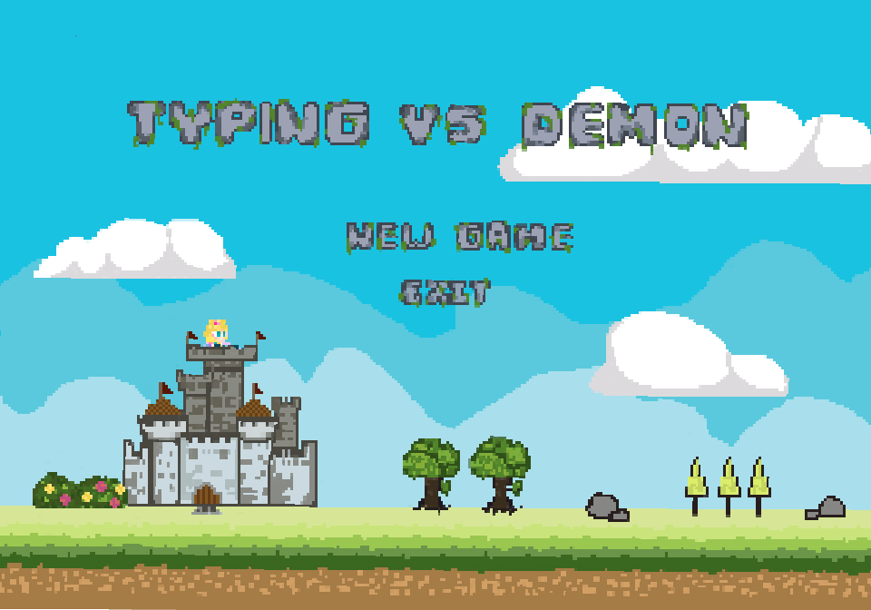
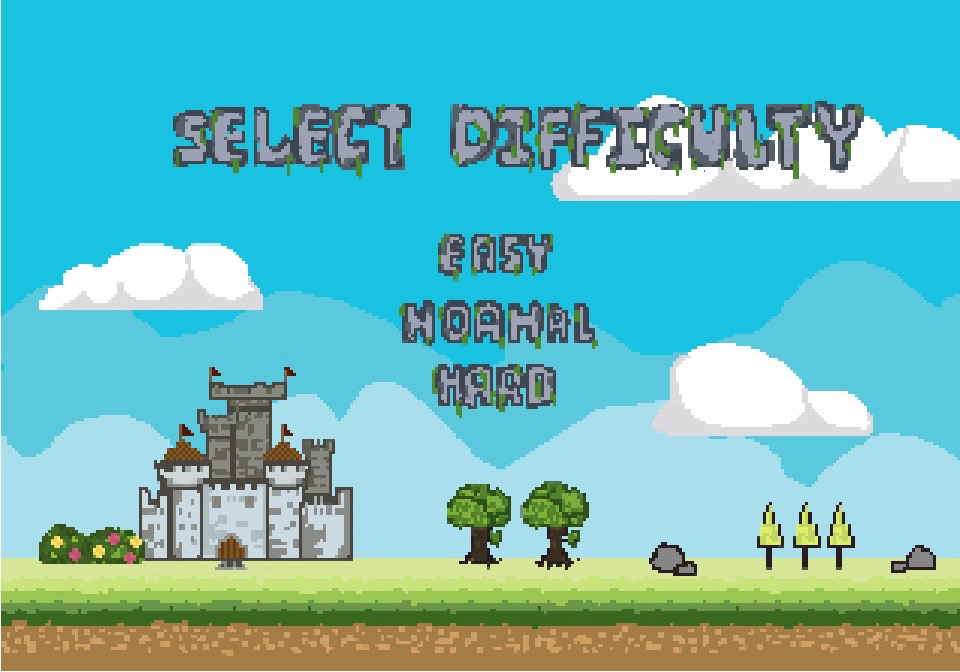

# Typing VS Demons  
**204114 Object Oriented Programming with Java Project**

[Computer Science, Chaing Mai University](https://www.cs.science.cmu.ac.th/), Thailand
## About The Game Project
  * This Project is designed to practice concepts of Object Oritend Programming (OOP)
  * If you want to improve your typing speed and accuracy, this game is for you!

## Screenshot

## Installation
### Windows
1. download `.exe` file from github directory `/DownloadApp/Windows`.
2. double-click install the `.exe` file in the directory you saved.
3. Once Installed, search the app **Typing VS Demons** and lauch the game.
4. Enjoy!

### Linux

  1. download `.deb` file from github directory `/DownloadApp/Linux`.
  2. double-click install `.deb` file in the directory you saved.
  3. Once Installed, search the app **Typing VS Demons** and lauch the game.
  4. Enjoy!

### Run in Java IDE
  
  * Requirements **Java 17** or higher
  * Apache NetBeans IDE
  1. Download the repository file (Project) from the download section or clone this project by typing in the command prompt/terminal :
     
          git clone https://github.com/Cellul4r/typing_vs_demon_game.git
     
  2. Import the project file in Apache NetBeans
  3. compile and run from IDE and Enjoy!

## Team Contribution
   * [cellul4r](https://github.com/Cellul4r) - Coding and Documentation
   * [Not-Tan](https://github.com/Not-Tan) - Coding and Documentation
   * [JellyFrist](https://github.com/Jellyfrist) - Documentation and Sound Management
   * [Fres26](https://github.com/Fres26) - Art, Animation and User Interface
   * [q28jes](https://github.com/q28jes) - Art, Animation and User Interface
   

